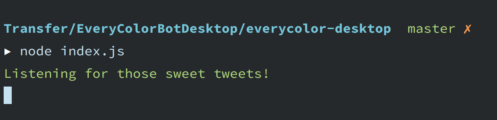
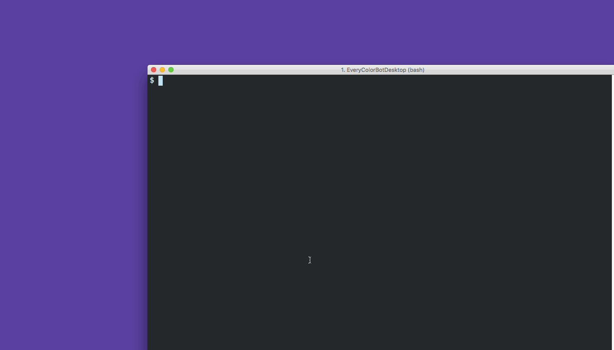

# Everycolor Desktop

A desktop background creator/setter that lovingly listens to the @everycolorbot twitter account. 

_Creating tweets that match the format of tweets sent by @everycolorbot._

## What's this all about?

I _absolutly love_ the [@everycolorbot](https://twitter.com/everycolorbot) twitter account. I love it so much that I want to put those colors to use :)

When you run this little node app it will listen for tweets coming from the bot, create a png file using the tweeted color, and set it as your desktop background. 

At the moment it only works for mac (I'm open to pull requests for Windows and Linux ;) ).

I'm still hammering out some bugs, but for the most part it's functional.

## Tools in this project

- [Everycolorbot Twitter Listener](#everycolorbot-twitter-listener)
- [pickcolor command line tool](#pickcolor-command-line-tool)

## Everycolorbot Twitter Listener

### What you'll need to run the utility

The requirements for this utility are actually really simple; you'll need [node.js](https://nodejs.org/) to run the utility, `npm` (which is installed when you install node.js) to pull in the dependencies, and [git](https://git-scm.com/) to pull down the repository.

Note that if you run this utility directly with node, you'll need to leave the terminal you run it in open for the utility to listen for tweets. You could also use something like [foreverjs](https://github.com/foreverjs/forever) if you wanted to run it in the background. 

### Pulling down the project

Open a terminal and `cd` to a directory where you'd like to store the utilities files. Once there run the `git clone` command to pull down the project. Once the project has been cloned, use `npm` to load the project's dependencies:

    cd ~/Development/
    git clone https://github.com/chris-schmitz/EveryColorBotDesktop.git EveryColorDesktop

    # project get's cloned to the folder "EveryColorDesktop". Once it's done:

    cd everycolor-desktop
    npm install

    # project dependencies are downloaded

#### A note about the project structure

The actually evercolor-desktop utility itself is all enclosed in the `everycolor-desktop` directory at the root of this repository. You don't actually need anything in the prototypes folder to run it.

The prototypes folder is just a collection of little sections of the overall utility that I put together while figuring out how to turn the concept into reality. I left them in this repository just in case they're helpful to anyone else. 

### Configuration

To use this utility you'll need to [create a Twitter App](https://apps.twitter.com/) so that you can obtain credentials for the Twitter API. 

Once you've created the app, you'll be able to go to the "Keys and Access Tokens" section of the app's configuration page to get the necessary credentials. 

The credentials you'll need are the:

- Consumer Key (API Key)
- Consumer Secret (API Secret)
- Access Token
- Access Token Secret

Once you've obtained these credentials, return to the `everycolor-desktop` directory of the project. In this directory there is a file called `config.example.js`. Make a copy of this file and save it as `config.js`.

In the new `config.js` file, enter your twitter credentials. You can also change any of the other configuration defaults here.

Now that the utility has been configured, let's talk about how to use it. 

### Usage

Using the everycolor-desktop utility is fairly simple. Once you have [node installed](##what-youll-need-to-run-the-utility), [the project cloned, the dependencies downloaded](#pulling-down-the-project), and [the configuration set up](#configuration) you'll just need to run the `everycolor-desktop/index.js` file using node. e.g.:

    # Assuming that you are already in the terminal and at the `EveryColorDeskop` directory:

    cd everycolor-desktop
    node index.js

Once you fire `node index.js` you should see that the utility is listening for tweets:

Now you can just wait for everycolorbot to decide your next desktop color ;)

## `pickcolor` command line tool

The `pickcolor` command line tool operates off of the colors captured from the everycolor-desktop Twitter Listener. Colors previously captured can be listed and set as the desktop background. 

### Usage

To list the files previously captured by the twitter listener, open a terminal and type the following command:

    pickcolor list-files

The list of file paths for the colors captured will be displayed. If you use [iTerm2](https://www.iterm2.com/) as your terminal, you will also see the color tile under the file path.

To set the desktop to a particular color file, use the following command:

    pickcolor set-desktop /path/to/the/file.png

This will use the twitter listener tools to set the desktop background and send an OS notification.

## What's in this project

I know you can just look through the `package.json` file to see what the top level dependencies for this project are, but to help make this more accessible for people who may be new to node development (similar to myself at the moment), I'd like to point out that the only top level dependencies for this project are:

- [Twitter sdk](https://www.npmjs.com/package/twitter)
- [pngjs](https://www.npmjs.com/package/pngjs)
- [Node Notifier](https://www.npmjs.com/package/node-notifier)
- [Chalk](https://www.npmjs.com/package/chalk)
- [co](https://github.com/tj/co)

That's it. You can totally dive in and understand this!

And really some of these dependencies are not even necessary, they're just nice to have (i.e. desktop notifications (node-notifier) and colored output for the command line (chalk)). 

I think the most complex part of this project is the use of promises and generators when creating the desktop image. If you're having a hard time wrapping your brain around it, consider reviewing the prototypes in `promises-and-generators` and watching this [fun fun functions video on generators](https://www.youtube.com/watch?v=ategZqxHkz4) by [@mpjme](https://twitter.com/mpjme). Out of all of the explanations of generators and iterations I've read/watched, his is the clearest. 

Dig a bit. If you have questions ping [me on twitter](https://twitter.com/cschmitz81) and I'll try to help you out.
