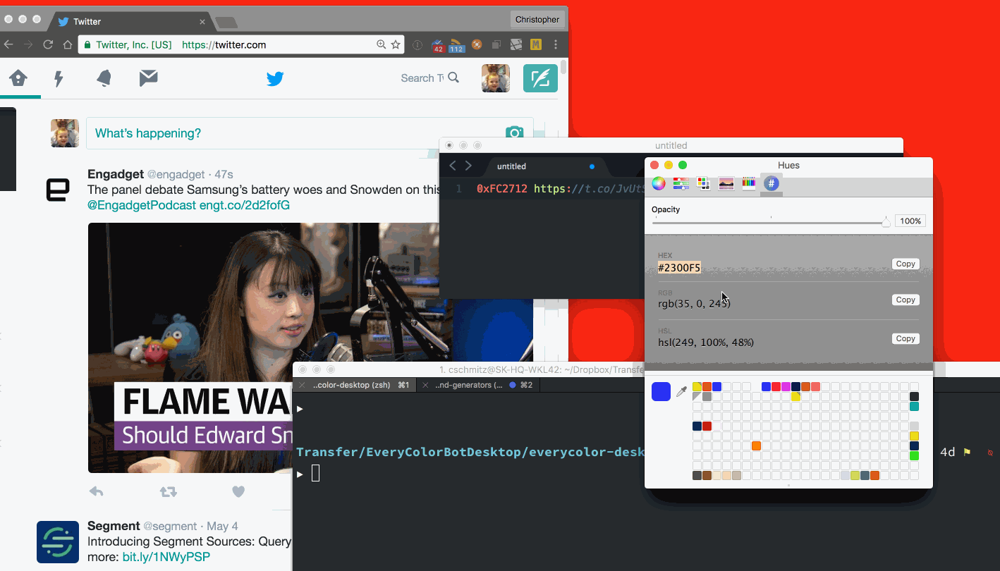

# Everycolor Desktop

A desktop background creator/setter that lovingly listens to the @everycolorbot twitter account. 

_Creating tweets that match the format of tweets sent by @everycolorbot._

## What's this all about?

I _absolutly love_ the [@everycolorbot](https://twitter.com/everycolorbot) twitter account. I love it so much that I want to put those colors to use :)

When you run this little node app it will listen for tweets coming from the bot, create a png file using the tweeted color, and set it as your desktop background. 

At the moment it only works for mac (I'm open to pull requests for Windows and Linux ;) ).

I'm still hammering out some bugs, but for the most part it's functional.

## Configuration

_I'll be filling this out later today. I have to run to breakfast ;P_

## What's in this project

I know you can just look through the `package.json` file to see what the top level dependencies for this project are, but to help make this more accessible for people who may be new to node development (similar to myself at the moment), I'd like to point out that the only top level dependencies for this project are:

- [Twitter sdk](https://www.npmjs.com/package/twitter)
- [pngjs](https://www.npmjs.com/package/pngjs)
- [Node Notifier](https://www.npmjs.com/package/node-notifier)
- [Chalk](https://www.npmjs.com/package/chalk)

That's it. You can totally dive in and understand this!

And really some of these dependencies are not even necessary, they're just nice to have (i.e. desktop notifications (node-notifier) and colored output for the command line (chalk)). 

Dig a bit. If you have questions ping [me on twitter](https://twitter.com/cschmitz81) and I'll try to help you out.
